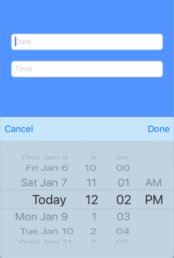

# UITextFieldDatePicker
This text field date picker helps you open date picker inside **UITextField** without a single line line of code. You will not able handle ***delegate*** of **UITextField** with **UITextFieldDatePicker**.



##How to Use
It is very simple and easy to use. You just need to follow below mensioned steps.

> Create **IBOutlet** of **UITextFieldDatePicker**

```swift
@IBOutlet weak var textFieldDate: UITextFieldDatePicker!
```

> Customize ***datePicker***

```swift
self.textFieldDate.datePicker.datePickerMode = .date
self.textFieldDate.datePicker.minimumDate = Date().addingTimeInterval(10*24*60*60*(-1))
self.textFieldDate.datePicker.maximumDate = Date().addingTimeInterval(10*24*60*60)
self.textFieldDate.dateFormatDisplay = "dd-MMM-YYYY"
```

> Set actions only **if you want**

> * You can set both left and right button

> * Or you can set any one of then or **none** of them

> * Action Style

> > **close**: It will automatically close picker view on button action 
> > 
> > **default**: You need to manually [close](README.md#closing-picker-view) picker view


```swift
textFieldDate.setRightButton("Done", style: .default) {
            self.textFieldDate.defaultSelectedDate = self.textFieldDate.selectedDate
            self.textFieldDate.showDefaultDate()
            self.textFieldDate.closePicker()
        }
                
textFieldDate.setLeftButton("Cancel", style: .close) {
            textFieldDate.showDefaultString()
        }
```

> Accessing selected value and setting default selected value

>> If you want to manually set any value, first set as ```defaultSelectedDate``` then call method ```showDefaultDate()```


```swift
self.textFieldDate.defaultSelectedDate = Date()
self.textFieldDate.showDefaultDate()
```

####Closing Picker View

To close date picker just call below method

```swift
friutTextField.closePicker()
```

##Licence

**[MIT](LICENSE)**
